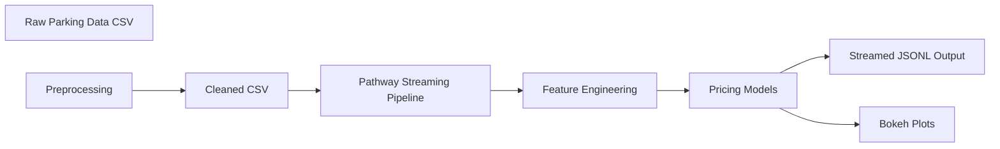

## Dynamic Parking Pricing Simulation

This project models **dynamic pricing** for urban parking lots using real-time data and multiple pricing strategies.


#  Repo Structure

```
 IITG_SA25_FINAL_HACKATHON/
├── notebooks/
│   └── simulation.ipynb
├── scripts/
│   └── pricing_pipeline.py
├── data/
│   ├── dataset.csv
│   └── cleaned.csv
├── outputs/
│   └── streamed_output.jsonl
├── diagrams/
│   └── architecture.md
│   └── architecture.png
└── README.md
```

### Overview

Urban parking spaces are limited. Static pricing leads to either overcrowding or underuse. This project simulates dynamic, demand-sensitive pricing using:

* **Occupancy-based linear pricing**
* **Demand-based pricing with multiple features**
* **Competition-aware pricing with rerouting recommendations**

It also features a **real-time simulation** and **interactive Bokeh visualization** of price evolution for multiple parking lots.

---

### Tech Stack

* **Python 3.10+**
* **Pandas** – data cleaning and preprocessing
* **Pathway** – real-time data pipeline
* **Bokeh** – interactive visualization
* **Geopy** – spatial calculations
* **Jupyter** – exploratory notebooks

---

### Architecture Diagram

> *(Rendered with Mermaid)*

<pre>

</pre>

Or you can **export an image** from [Mermaid Live Editor](https://mermaid.live/) and put it in `/diagrams/`.

---

### Project Architecture & Workflow

1️⃣ **Data Ingestion**

* Load raw parking lot CSV
* Merge date/time columns
* Map vehicle weights, traffic conditions, etc.

2️⃣ **Preprocessing**

* Compute occupancy rates
* Handle missing values
* Save as cleaned CSV for static/streaming simulation

3️⃣ **Pathway Streaming**

* Simulate real-time ingestion
* Define schema (timestamps, lot IDs, occupancy, etc.)
* Apply UDFs for feature engineering

4️⃣ **Pricing Models**

* **Baseline**: Linear occupancy-based pricing
* **Demand-based**: Feature-weighted pricing with normalization
* **Competition-aware**: Adjusts price if nearby lots have lower prices; suggests rerouting when full

5️⃣ **Output**

* Write pricing results to JSONL (for streaming output)
* Visualize in Jupyter with interactive Bokeh charts

---

### Folders & Files

| Path         | Description                               |
| ------------ | ----------------------------------------- |
| `notebooks/` | Jupyter notebooks for interactive testing |
| `scripts/`   | Main pipeline as standalone Python script |
| `data/`      | Input CSVs (raw and cleaned)              |
| `outputs/`   | Generated streamed JSONL output           |
| `diagrams/`  | Architecture diagrams (Mermaid or PNG)    |
| `report.pdf` | (Optional) extra write-up                 |

---

###  How to Run

1️⃣ Clone the repo:

```
git clone https://github.com/YOUR_USERNAME/your-parking-pricing-project.git
```

2️⃣ Install requirements:

```
pip install -r requirements.txt
```

3️⃣ Run Jupyter notebook:

```
jupyter notebook notebooks/simulation.ipynb
```

4️⃣ Or run the pipeline script:

```
python scripts/pricing_pipeline.py
```

---

### Notes

The **Pathway pipeline** is designed to handle both static and streaming modes.
The **Bokeh visualization** demonstrates price dynamics for multiple lots in real time.
**Reroute suggestions** are generated for full lots with nearby availability.

---
